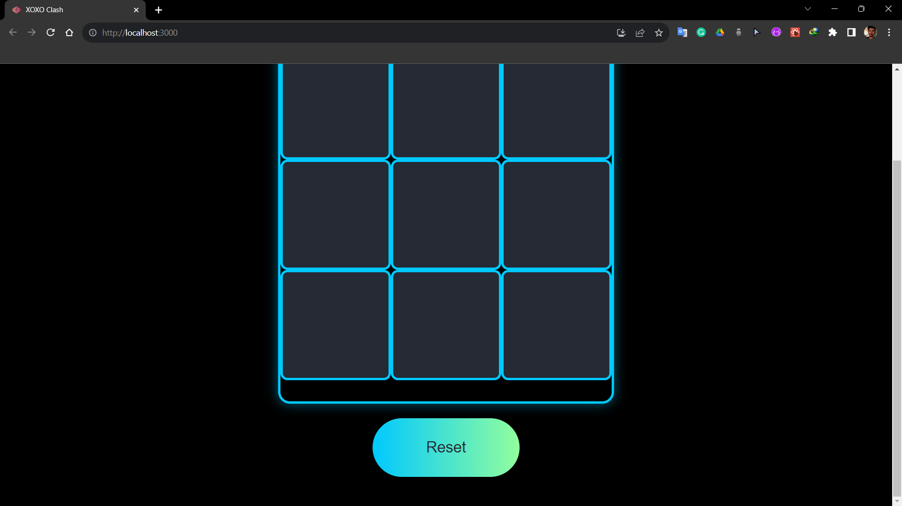
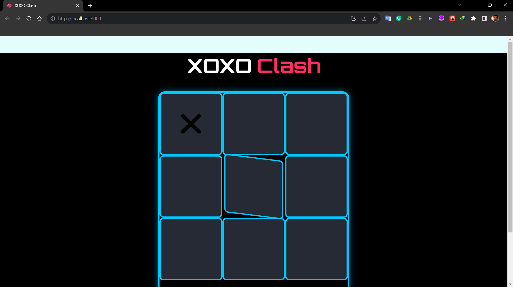
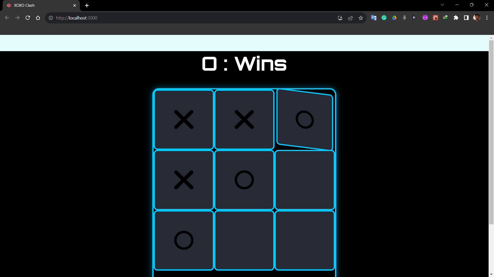

# XOXO Clash - React.js Tic Tac Toe Game






XOXO Clash is a simple and fun Tic Tac Toe game built using React.js. Challenge your friends or play against the computer and see who can claim victory in this classic game of strategy.

## Table of Contents

- [Features](#features)
- [Getting Started](#getting-started)
- [How to Play](#how-to-play)
- [Contributing](#contributing)
- [License](#license)

## Features

- Single-player mode against a computer AI.
- Multiplayer mode for playing against friends.
- Responsive design for both desktop and mobile devices.
- Keeps track of the game's history.
- Ability to restart the game at any time.
- Clear and intuitive user interface.

## Getting Started

Follow these steps to get a copy of XOXO Clash up and running on your local machine.

### Prerequisites

- [Node.js](https://nodejs.org/) installed on your computer.

### Installation

1. Clone the repository:

   ```bash
   git clone https://github.com/your-username/xoxo-clash.git
   cd xoxo-clash

2. Install Dependencies:

   ```bash
   npm install

3. Start the development server:

   ```bash
   npm start

4. Open your browser and navigate [here](http://localhost:3000)!

## How To Play:

- XOXO Clash is a classic Tic Tac Toe game where two players take turns marking spaces in a 3x3 
  grid.

- The objective is to be the first to get three of your marks (X or O) in a row, column, or 
  diagonal.

- To make a move, click on an empty space on the game board.
- The game will announce the winner or declare a draw when the game ends.

## Contributing:

We welcome contributions to make XOXO Clash even better! If you'd like to contribute, please follow these guidelines:

1. Fork the repository.
2. Create a new branch for your feature or bug fix.
3. Make your changes and commit them.
4. Push your changes to your fork and open a pull request.
5. Please ensure your code follows the existing coding style and includes appropriate tests.

## Contact Me
Enjoy playing XOXO Clash! If you have any questions or suggestions, feel free to open an issue or reach out to us at [here](www.quicksilver92571331@gmail.com)!
